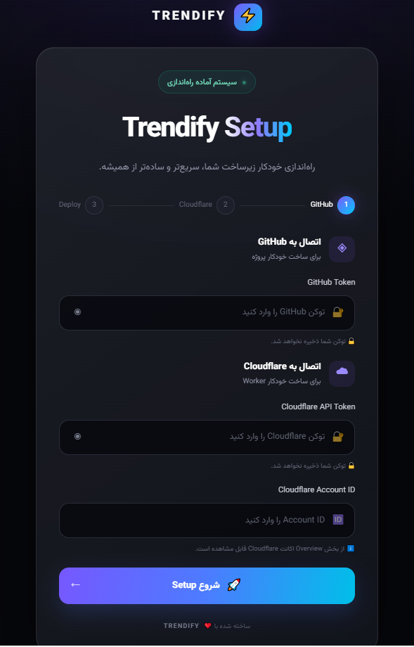

# trendify-pnanel
# 🚀 Trendify Dashboard

> پروژه‌های کاربردی در حوزه هوش مصنوعی، تکنولوژی، ابزارهای دیجیتال و آموزش‌های کاربردی.

### 🌐 Connect with Trendify

📺 **YouTube:** [@trendify61](https://www.youtube.com/@trendify61)

💬 **Telegram:** [@multi_bit](https://t.me/multi_bit)

اگر از پروژه‌های Trendify استفاده می‌کنید، با **⭐ Star** کردن Repository و دنبال کردن کانال‌های ما از پروژه حمایت کنید. ❤️

---

# 🚀 Trendify Dashboard

> داشبورد ساده، سریع و مدرن برای راه‌اندازی و مدیریت پروژه‌های Trendify.

[🇮🇷 فارسی](#فارسی) · [🇬🇧 English](#english)

---

# فارسی

## 🚀 معرفی

**Trendify Dashboard** یک داشبورد تحت وب سبک و مدرن است که با هدف ساده‌تر کردن فرآیند راه‌اندازی و مدیریت سرویس‌های Trendify ساخته شده است.

هدف پروژه این است که فرآیندهای فنی و پیچیده را به یک تجربه ساده و قابل استفاده برای کاربران تبدیل کند.

---

## ✨ امکانات

* 🎨 رابط کاربری مدرن و ساده
* ⚡ سبک و سریع
* ☁️ اتصال به Cloudflare
* 🐙 اتصال به GitHub
* 🚀 فرآیند راه‌اندازی ساده
* 📦 آماده برای توسعه و شخصی‌سازی
* 📱 طراحی واکنش‌گرا
* 🛠️ ساختار قابل توسعه

---

## 🖥️ داشبورد

### 🚀 ورود به داشبورد

**[باز کردن Trendify Dashboard →](https://trendify-setup.pages.dev/)**

> `https://trendify-setup.pages.dev/` را با لینک واقعی داشبورد خودت جایگزین کن.

---

## 📸 پیش‌نمایش

برای نمایش تصویر داشبورد می‌توانی یک اسکرین‌شات در پوشه `assets` قرار بدهی:

markdown
## 📸 پیش‌نمایش

برای نمایش تصویر داشبورد:




## 🧩 ساختار پروژه

```text
trendify-dashboard/
│
├── index.html
├── style.css
├── app.js
├── assets/
│   └── ...
│
└── README.md
```

---

## ⚙️ نحوه کار

داشبورد یک رابط ساده برای تنظیم سرویس‌های موردنیاز و اجرای فرآیند راه‌اندازی Trendify فراهم می‌کند.

```text
کاربر
  │
  ▼
Trendify Dashboard
  │
  ├── GitHub
  │
  ├── Cloudflare
  │
  └── Deployment
        │
        ▼
     Trendify
```

هدف اصلی این پروژه، حذف مراحل غیرضروری و ساده‌تر کردن فرآیند راه‌اندازی است.

---

## 🔐 امنیت

**هیچ‌وقت اطلاعات حساس را داخل این Repository عمومی قرار ندهید.**

از قرار دادن موارد زیر در GitHub خودداری کنید:

* API Token
* GitHub Personal Access Token
* Cloudflare API Token
* Password
* Private Key
* اطلاعات ورود به سرور
* UUIDهای خصوصی
* اطلاعات محرمانه پروژه

اطلاعات حساس باید خارج از Repository و در محیط امن نگهداری شوند.

---

## 🛠️ شخصی‌سازی

می‌توانید داشبورد را مطابق نیاز خود تغییر دهید.

موارد قابل شخصی‌سازی:

* 🎨 رنگ‌بندی
* 🏷️ نام و Branding
* 🖼️ لوگو
* 📝 متن‌ها
* 📐 Layout
* ⚙️ قابلیت‌های داشبورد
* 🔌 تنظیمات API

---

## 🤝 مشارکت در پروژه

اگر ایده‌ای برای بهتر شدن Trendify Dashboard دارید، خوشحال می‌شویم مشارکت کنید.

برای مشارکت:

1. Repository را Fork کنید.
2. یک Branch جدید بسازید.
3. تغییرات خود را اعمال کنید.
4. یک Pull Request ارسال کنید.

---

## ⭐ حمایت از پروژه

اگر **Trendify Dashboard** برای شما مفید بود، با دادن یک ⭐ **Star** از پروژه حمایت کنید.

Star کردن Repository باعث می‌شود پروژه بیشتر دیده شود و انگیزه‌ای برای توسعه نسخه‌های بعدی باشد.

**هر Star ❤️ برای ما ارزشمند است.**

---

## 💡 گزارش مشکل و پیشنهاد

اگر با مشکلی مواجه شدید یا پیشنهادی برای بهتر شدن پروژه دارید، یک **Issue** ایجاد کنید.

بازخورد شما می‌تواند در توسعه نسخه‌های آینده بسیار کمک‌کننده باشد.

---

## 📺 Trendify

**Trendify** با تمرکز روی موضوعات زیر فعالیت می‌کند:

* 🤖 هوش مصنوعی
* 💻 تکنولوژی
* 🌐 ابزارهای دیجیتال و اینترنت
* 🧠 آموزش و آموزش‌های کاربردی
* 🚀 فناوری‌های جدید

---

## 📄 مجوز

این پروژه برای اهداف آموزشی و شخصی ارائه شده است.

برای شرایط کامل استفاده، فایل `LICENSE` را مطالعه کنید.

---

## ❤️ ممنون که از پروژه بازدید کردی

اگر Trendify Dashboard برایت مفید بود:

⭐ **به پروژه Star بده**

📺 **Trendify را دنبال کن**

🚀 **به ساختن ادامه بده**

---

# English

## 🚀 About

**Trendify Dashboard** is a lightweight and modern web dashboard designed to simplify the setup and management of Trendify services.

The main goal is to turn complex technical workflows into a simple and accessible user experience.

---

## ✨ Features

* 🎨 Clean and modern interface
* ⚡ Lightweight and fast
* ☁️ Cloudflare integration
* 🐙 GitHub integration
* 🚀 Simple setup workflow
* 📦 Easy to customize
* 📱 Responsive design
* 🛠️ Extensible project structure

---

## 🖥️ Dashboard

### 🚀 Open Dashboard

**[Open Trendify Dashboard →](https://trendify-setup.pages.dev/)**

> Replace `https://trendify-setup.pages.dev/` with your actual dashboard URL.

---

## 📸 Preview

Add a dashboard screenshot inside the `assets` directory:


---

## 🧩 Project Structure

```text
trendify-dashboard/
│
├── index.html
├── style.css
├── app.js
├── assets/
│   └── ...
│
└── README.md
```

---

## ⚙️ How It Works

The dashboard provides a simple interface for configuring the required services and starting the Trendify setup process.

```text
User
  │
  ▼
Trendify Dashboard
  │
  ├── GitHub
  │
  ├── Cloudflare
  │
  └── Deployment
        │
        ▼
     Trendify
```

The goal is to remove unnecessary complexity and provide a straightforward setup experience.

---

## 🔐 Security

**Never commit sensitive information to this public repository.**

Do not upload:

* API Tokens
* GitHub Personal Access Tokens
* Cloudflare API Tokens
* Passwords
* Private Keys
* Server credentials
* Private UUIDs
* Environment secrets

Keep sensitive credentials outside the public repository and use secure secret-management solutions whenever possible.

---

## 🛠️ Customization

You are free to customize the dashboard according to your needs.

You can modify:

* 🎨 Colors
* 🏷️ Branding
* 🖼️ Logo
* 📝 Text
* 📐 Layout
* ⚙️ Dashboard features
* 🔌 API configuration

---

## 🤝 Contributing

Contributions, ideas, and improvements are welcome.

To contribute:

1. Fork the repository.
2. Create a new branch.
3. Make your changes.
4. Submit a Pull Request.

---

## ⭐ Support the Project

If you find **Trendify Dashboard** useful, consider giving the repository a ⭐ **Star**.

Stars help the project gain visibility and motivate future development.

**Every Star ❤️ means a lot.**

---

## 💡 Issues & Suggestions

Found a bug or have an idea?

Open an **Issue** and share your feedback.

Your feedback helps improve future versions of the project.

---

## 📺 Trendify

**Trendify** focuses on:

* 🤖 Artificial Intelligence
* 💻 Technology
* 🌐 Internet & Digital Tools
* 🧠 Tutorials & How-To Guides
* 🚀 Emerging Technologies

---

## 📄 License

This project is provided for educational and personal use.

Please see the `LICENSE` file for the complete license terms.

---

## ❤️ Thank You

Thanks for checking out **Trendify Dashboard**.

If you find the project useful:

⭐ **Star the repository**

📺 **Follow Trendify**

🚀 **Keep building**

